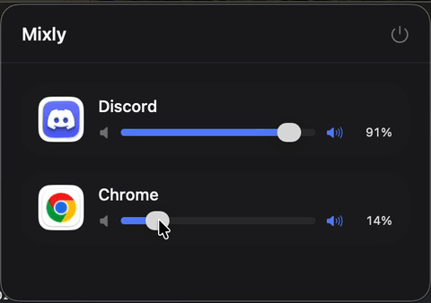

# Mixly

**English** | [Português (BR)](README.pt-br.md)

[](LICENSE)

[](https://github.com/edilson14/Mixly/releases/latest)

**Mixly is a per-app volume mixer for macOS** — it lets you control the volume of individual applications independently, the same way Windows' built-in volume mixer works. macOS has never shipped this natively; Mixly adds it as a small menu bar app.

Playing music in one app while a video call is loud in another? Turn one down without touching the other, straight from the menu bar — no need to pause anything or dig through each app's own volume setting.



## Installation

Download the latest `.dmg` from [Releases](https://github.com/edilson14/Mixly/releases/latest) and drag `Mixly.app` to `/Applications`.

> **Note:** This build isn't signed with an Apple Developer ID, so macOS Gatekeeper will warn on first launch. Right-click (or Control-click) `Mixly.app` and choose **Open** — or go to **System Settings → Privacy & Security** and click **Open Anyway**. You only need to do this once.

## Features

- **Per-app volume mixing** — see every app currently producing audio and adjust its volume (or mute it) independently, without touching the others.
- **Per-app output device routing** — send an app's audio to a specific output device (e.g. Spotify to a USB headset while Chrome stays on the Mac speakers), independently for each app.
- **Lives in the menu bar** — no dock icon, no window to manage. Click the icon, adjust, done.
- **Live audio activity** — the list refreshes automatically as apps start making sound.
- **Helper process grouping** — auxiliary processes (e.g. browser helpers) are grouped under their parent app, so multiple processes from the same app appear as one entry.

## How it works

macOS doesn't expose a native per-app volume mixer, so Mixly builds one using **Core Audio Process Taps**:

1. It enumerates the audio-producing processes registered with the system HAL (`kAudioHardwarePropertyProcessObjectList`) and groups them by owning application.
2. When you change an app's volume or pick a custom output device, Mixly creates a **process tap** (`ProcessTap.swift`) for that app's processes with `muteBehavior = .mutedWhenTapped`, which silences the app's original output.
3. A private aggregate device combines the tap with the chosen output device — the system default, or one you picked per app (`AudioOutputDevice.swift` enumerates the available devices). Mixly's IO proc reads the tapped audio, applies the chosen gain, and renders it back to that device.
4. Setting the volume back to 100% *and* leaving the output device on "System Default" removes the tap entirely, restoring the app's original audio path. If a custom output device is selected, the tap stays alive at 100% volume too — it's the only way to redirect the audio at all.

This means Mixly doesn't just change a volume value — it actually re-renders each app's captured audio stream at the gain (and to the output device) you set.

> **Note:** macOS reports an app's audio session as active for as long as the app keeps it open, which for most apps includes while paused — not just while actual sound is playing. So an app may stay in Mixly's list for a while after you pause it; it disappears once the app fully releases its audio session (usually on quit).

## Requirements

- macOS 26 (Tahoe) or later
- Xcode 26+ to build
- "Audio Capture" permission, granted on first use via **System Settings → Privacy & Security → Screen & System Audio Recording**

## Building from source

```bash
git clone https://github.com/edilson14/Mixly.git
cd Mixly
xcodebuild build -scheme Mixly -configuration Release
```

## Building & packaging a DMG

```bash
./build_and_distribute.sh YOUR_TEAM_ID
```

See [DISTRIBUTION.md](DISTRIBUTION.md) for the full build, signing, and notarization workflow.

## Project structure

| File | Purpose |
|---|---|
| `MixlyApp.swift` | App entry point — sets up the `MenuBarExtra` scene |
| `AudioKitController.swift` | Discovers audio processes, groups them by app, and manages taps |
| `ProcessTap.swift` | Wraps `AudioHardwareCreateProcessTap` and the aggregate device used to re-render audio with gain to a chosen output device |
| `AudioOutputDevice.swift` | Enumerates the system's available output devices |
| `AudioKitAppView.swift` | Per-app mixer UI (list, sliders, mute, output device picker) |
| `ContentView.swift` | Root view of the menu bar popover |

## License

MIT — see [LICENSE](LICENSE).
